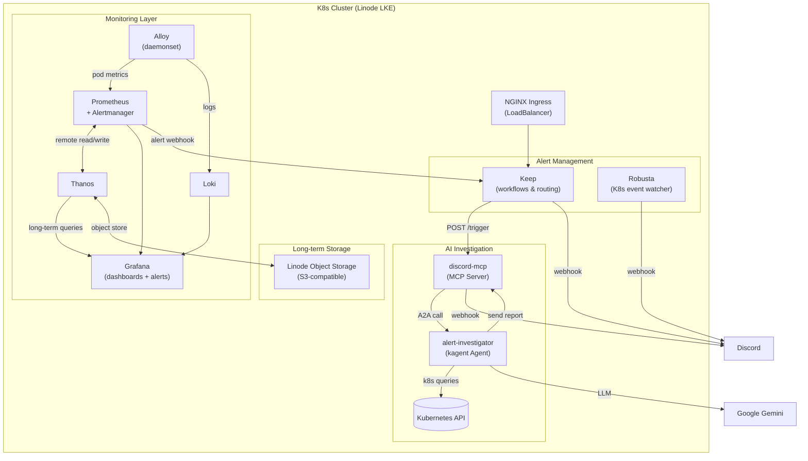
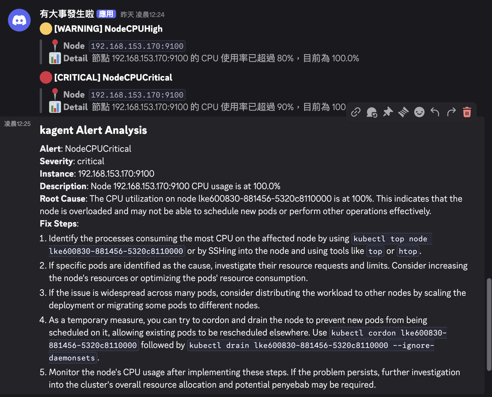

# kagent-aiops-infra-iac

> 繁體中文版請見 [README.zh-TW.md](README.zh-TW.md)

Kubernetes observability and automated incident response, provisioned entirely with Terraform on Linode LKE.

When an alert fires, the pipeline automatically investigates the cluster using a kagent AI agent (Gemini), then posts findings to Discord — no human intervention needed for first-response triage.

---

## Architecture



## Alert Flow

1. Grafana alert rule fires (CPU or memory threshold breached)
2. Alertmanager routes the alert to Keep via webhook
3. Keep workflow evaluates severity:
   - **warning** — sends a notification to Discord
   - **critical** — sends a notification to Discord, then calls `discord-mcp` trigger endpoint
4. `discord-mcp` receives the trigger and calls kagent's A2A API
5. `alert-investigator` agent runs:
   - Calls `k8s_get_resources`, `k8s_describe_resource`, `k8s_get_events` to inspect the cluster
   - Calls `send_discord_message` with a structured root-cause analysis
6. Discord receives the AI-generated investigation report

## Components

| Component | Role | Namespace |
|---|---|---|
| Prometheus | Scrapes cluster metrics; routes alerts to Keep via Alertmanager | `monitoring` |
| Grafana | Dashboards and alert rules (CPU/Memory warn/crit at 80%/90%) | `monitoring` |
| Alloy | Metrics and log collector (daemonset) | `monitoring` |
| Loki | Log aggregation backend | `monitoring` |
| Thanos | Long-term metrics storage with Linode Object Storage (S3) | `monitoring` |
| Keep | Alert aggregation, deduplication, and workflow engine | `keep` |
| Robusta | Watches Kubernetes events and streams them to Discord | `robusta` |
| NGINX Ingress | LoadBalancer ingress for Keep UI and API | `ingress-nginx` |
| kagent | Kubernetes-native AI agent framework | `kagent` |
| alert-investigator | Declarative AI agent: receives alerts, queries K8s, posts findings to Discord | `kagent` |
| discord-mcp | Custom Python MCP server — bridges Keep webhook triggers to kagent A2A and Discord | `kagent` |

## Alert Rules

| Rule | Warning threshold | Critical threshold |
|---|---|---|
| Node CPU usage | > 80% for 30s | > 90% for 30s |
| Node Memory usage | > 80% for 30s | > 90% for 30s |

## Prerequisites

- [Terraform](https://developer.hashicorp.com/terraform/install) >= 1.5
- [kubectl](https://kubernetes.io/docs/tasks/tools/)
- [Task](https://taskfile.dev/installation/)
- Linode account with API token
- Google Gemini API key (free tier is sufficient)
- Discord webhook URL

## Setup

```bash
# 1. Copy the example vars file and fill in your secrets
cp terraform.tfvars.example terraform.tfvars

# 2. Initialize providers
terraform init

# 3. Provision everything
terraform apply
```

`terraform apply` provisions the LKE cluster, installs all Helm charts, deploys the kagent agents and MCP server, and configures all alert workflows in a single run.

## Common Tasks

```bash
task apply          # terraform apply
task destroy        # terraform destroy

task nodes          # kubectl get nodes
task pods           # kubectl get pods -A

task grafana-ip     # print Grafana LoadBalancer IP
task keep-url       # print Keep UI URL
task keep-status    # kubectl get pods -n keep
task keep-logs      # tail keep-backend logs

task traffic-start  # launch cpu-stress job to trigger alerts
task traffic-stop   # delete cpu-stress job
task traffic-logs   # tail cpu-stress pod logs
task traffic-status # show pod status and node resource usage
```

## Variables

| Variable | Description |
|---|---|
| `linode_token` | Linode API token |
| `grafana_admin_password` | Grafana admin password |
| `gemini_api_key` | Google Gemini API key (used by kagent's ModelConfig) |
| `keep_secret_key` | Keep platform JWT secret |
| `discord_webhook_url` | Discord incoming webhook URL |
| `robusta_signing_key` | Robusta platform signing key |

## Demo

When a CPU stress job pushes node utilization past the alert thresholds, the full pipeline runs automatically:

1. Keep receives the alert from Alertmanager and posts warning/critical notifications to Discord
2. For critical alerts, kagent's `alert-investigator` agent investigates the cluster and posts a structured root-cause analysis



## Notes

- `terraform.tfvars` and all `terraform.tfstate*` files are gitignored. Never commit them — state files contain plaintext secrets.
- The discord-mcp server listens on two ports: `:8085` (MCP/Streamable-HTTP for kagent tool calls) and `:8086` (HTTP trigger endpoint called by Keep workflows).
- Thanos retains raw metrics for 30 days, 5m-downsampled for 90 days, and 1h-downsampled for 1 year.
